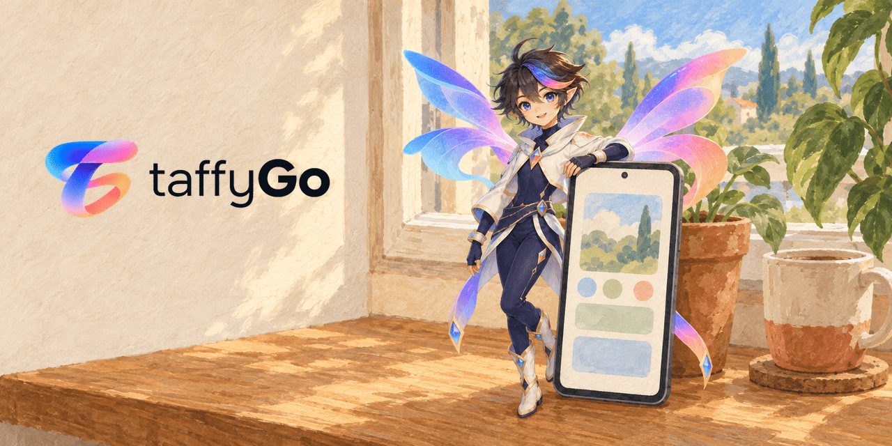
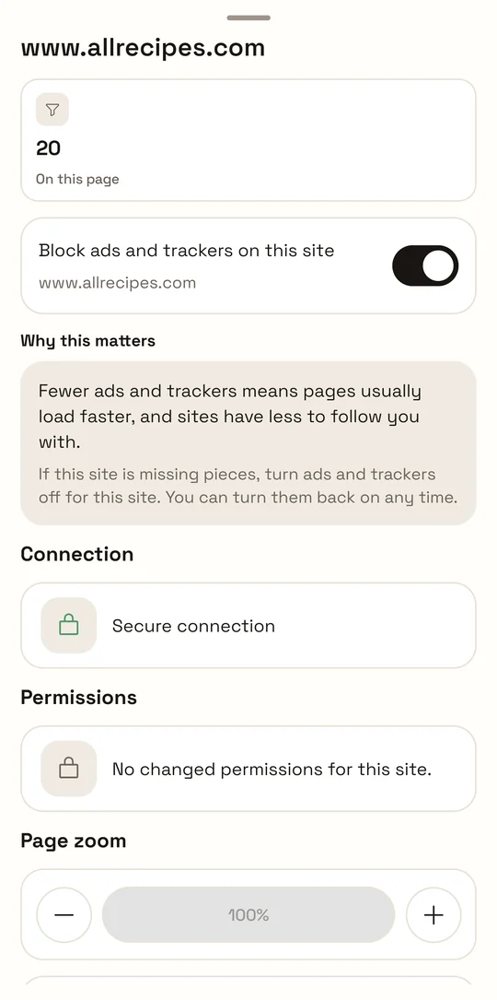
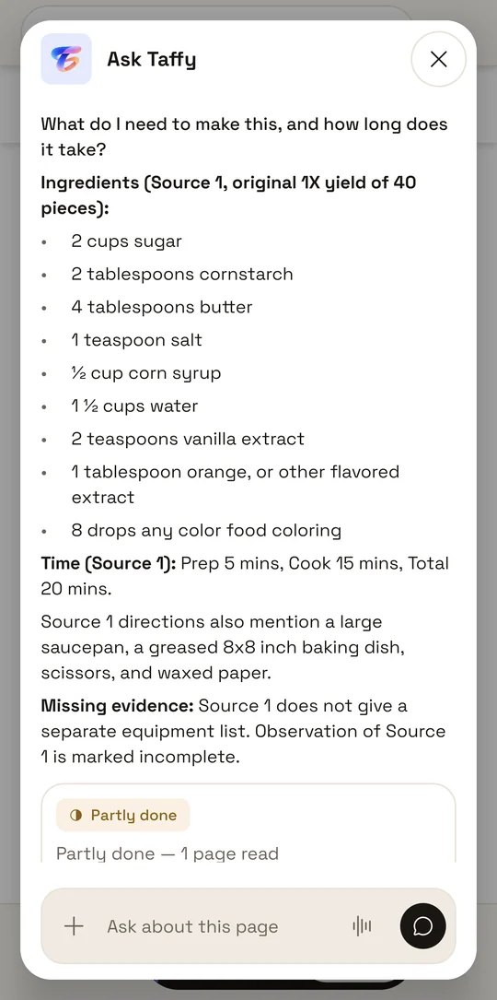
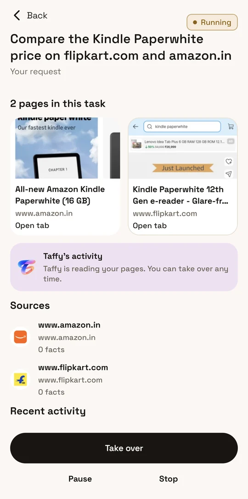
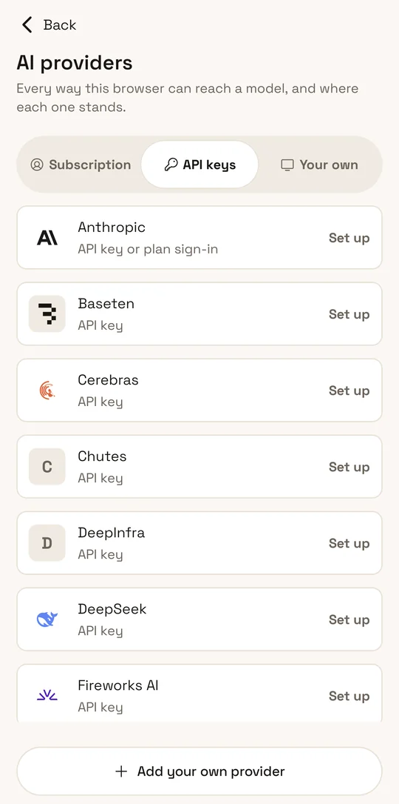
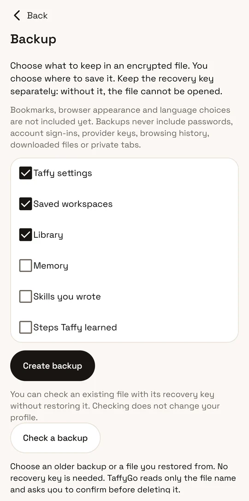
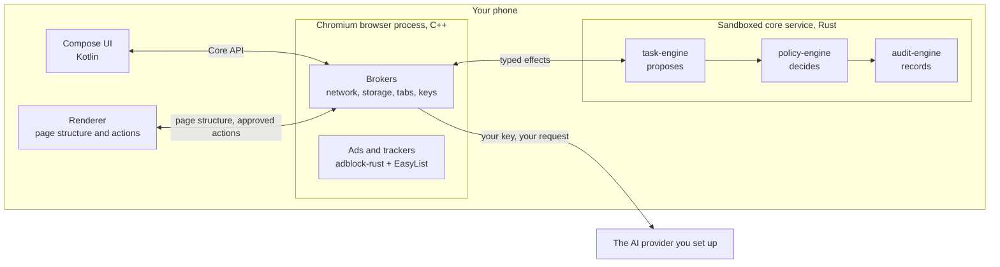

<p align="center">
  
</p>

<h3 align="center">
  A Chromium browser for Android with ads and trackers blocked, and one assistant,
  Taffy, that works in its own tabs, shows every step and asks before it acts.
</h3>

<p align="center">
  <a href="https://github.com/satyajiit/taffygo/blob/main/LICENSE"></a>
  <a href="https://github.com/satyajiit/taffygo/releases/latest"></a>
  
  
  <a href="https://github.com/satyajiit/taffygo/stargazers"></a>
</p>

<p align="center">
  <a href="https://play.google.com/store/apps/details?id=com.taffygo.browser"></a>
  <a href="https://github.com/satyajiit/taffygo/releases/latest"></a>
</p>

<p align="center">
  <a href="https://taffygo.com">Website</a> ·
  <a href="#install">Download</a> ·
  <a href="#build-from-source">Build</a> ·
  <a href="CONTRIBUTING.md">Contribute</a> ·
  <a href="SECURITY.md">Security</a>
</p>

## Watch TaffyGo

https://github.com/user-attachments/assets/a15d0af1-5d7b-4fde-ad25-c423d3d7f68c

The 1 minute 58 second launch film, in 4K at 60 fps with sound.
[Watch on the website](https://taffygo.com/#launch-film) for English captions,
or [download the film](https://taffygo.com/media/taffygo-launch-4k60.webm).

<table align="center">
  <tr>
    <td align="center"></td>
    <td align="center"></td>
    <td align="center"></td>
    <td align="center"></td>
    <td align="center"></td>
  </tr>
  <tr>
    <td align="center"><sub>Ads and trackers</sub></td>
    <td align="center"><sub>Ask about a page</sub></td>
    <td align="center"><sub>A task in its own tabs</sub></td>
    <td align="center"><sub>Your provider</sub></td>
    <td align="center"><sub>Encrypted backup</sub></td>
  </tr>
</table>

<p align="center"><sub>Real screens, captured on a phone.</sub></p>

## What TaffyGo is

TaffyGo is a web browser for Android phones, built from Chromium 152. Ads and
trackers are blocked from the first page you open. It has one assistant,
Taffy, which answers questions about the page you are reading or takes a task
off your hands, such as comparing a price on two shops. Taffy does that work in
tabs of its own, where you can watch every step and take over at any moment.

Taffy talks to an AI provider that you set up: an API key, a plan you already
pay for, or a model server you run. TaffyGo runs no server and has no account.
Your history, bookmarks, Library and Memory are kept on the phone, and Taffy's
requests go from the phone straight to your provider.

### What it is not

- **It does not come with AI access.** TaffyGo sells none. Without a
  provider it is still a complete browser with blocking, and Taffy waits until
  you connect one.
- **It is not Google Chrome.** It is built from Chromium's open source and
  carries no Google API keys, so there is no Google sign-in or sync. Google
  neither makes nor endorses it.
- **It runs on Android phones only**: 64-bit ARM, Android 10 or later.
- **It is new.** 1.0 is the first release, and so far it has been tested on
  one physical phone. If it misbehaves on yours,
  [open an issue](https://github.com/satyajiit/taffygo/issues/new/choose) with
  the phone model and Android version.

## Features

<table>
  <tr>
    <td width="50%" valign="top">
      <b>Ads and trackers blocked</b><br>
      Blocking is on for every site by default, and each site has its own
      switch. Matching runs on adblock-rust against EasyList and EasyPrivacy,
      and both lists ship inside the app.
    </td>
    <td width="50%" valign="top">
      <b>Ask about the page</b><br>
      Ask Taffy about the page in front of you. The answer comes from that
      page, names the source it used, and says what the page did not cover.
    </td>
  </tr>
  <tr>
    <td valign="top">
      <b>Tasks in Taffy's own tabs</b><br>
      Hand Taffy a job such as comparing a price on two shops. It opens its own
      tabs, kept apart from yours, and describes each step in plain words. Take
      over, pause or stop whenever you like.
    </td>
    <td valign="top">
      <b>It asks before it acts</b><br>
      Taffy needs your OK to open more tabs. Before it fills a form it shows
      you the exact values, and your approval works once and never submits the
      form. It will not type a password or a code; it hands the page back to
      you for that.
    </td>
  </tr>
  <tr>
    <td valign="top">
      <b>Your provider, your key</b><br>
      38 providers are built in. Paste an API key, or sign in with an account
      you already have at six of them, including Anthropic, OpenAI and
      OpenRouter. You can also add your own server: Ollama, LM Studio,
      llama.cpp, vLLM or any OpenAI-compatible one. The phone's keystore seals
      each key, and TaffyGo sends it only to its provider.
    </td>
    <td valign="top">
      <b>No account, no TaffyGo server</b><br>
      There is nothing to sign up for. Your history and what Taffy remembers
      stay on the phone, and there is no TaffyGo server to send them to.
    </td>
  </tr>
  <tr>
    <td valign="top">
      <b>An encrypted backup you hold</b><br>
      Pick what goes in: Taffy settings, saved workspaces, Library and Memory.
      The file is sealed with AES-256-GCM under a recovery key that only you
      keep. It never contains passwords, sign-ins, provider keys or browsing
      history.
    </td>
    <td valign="top">
      <b>Workspaces and Memory you can see</b><br>
      Save what a task found as a workspace and come back to it later. Memory
      is a list of notes about how you like to work, and you can add, edit or
      delete any of them.
    </td>
  </tr>
</table>

## How it works

TaffyGo is Chromium with TaffyGo's own code mounted into it at `//taffy`.



- **The browser process** is Chromium's, in C++. It owns the network, storage,
  tabs and your keys, and it makes every request, including the ones to your
  AI provider.
- **The core service** holds Taffy's logic, in Rust, inside a sandboxed
  utility process. It never receives a key, a cookie, a file path or a
  network connection. `task-engine` proposes a step, `policy-engine` decides
  whether it is allowed, `audit-engine` records it, and the browser performs
  it.
- **The renderer** reports the structure of a page and carries out actions on
  it. The browser authorises every action separately, and a renderer never
  holds that authority itself.
- **The Compose UI** is Kotlin and talks to the browser through one generated
  interface.

Every seam between those parts is a generated contract with golden fixtures,
under `taffy-core/contracts/`.

## Install

### Google Play

[Get TaffyGo on Google Play](https://play.google.com/store/apps/details?id=com.taffygo.browser).
It needs a 64-bit ARM phone with Android 10 or later.

### From GitHub, with a signature check

Download `TaffyGo-1.0.0-arm64.apk` and `SHA256SUMS` from the
[latest release](https://github.com/satyajiit/taffygo/releases/latest), put
them in one folder, and run:

```bash
sha256sum -c SHA256SUMS
apksigner verify --print-certs TaffyGo-1.0.0-arm64.apk
```

The first command must print `TaffyGo-1.0.0-arm64.apk: OK` (on macOS, run
`shasum -a 256 -c SHA256SUMS`). The second must print a
`certificate SHA-256 digest` line carrying this fingerprint. The label before
it depends on your build-tools version: older ones print `Signer #1`, and
build-tools 37 prints the signature scheme instead.

```text
1a841fa23645a27609d4d1b8b88e2b2dac5a7bf1303166528e9fa0df3fde3a23
```

The same fingerprint in colon form, as `keytool` prints it:

```text
1A:84:1F:A2:36:45:A2:76:09:D4:D1:B8:B8:8E:2B:2D:AC:5A:7B:F1:30:31:66:52:8E:9F:A0:DF:3F:DE:3A:23
```

If either check fails, do not install the file. `apksigner` comes with the
Android SDK build-tools. Install with `adb install TaffyGo-1.0.0-arm64.apk`, or
open the file on the phone.

Google signs the Play copy with a key Google holds, so Android will not update
a Play install with the GitHub APK or the other way round. To switch, uninstall
first, which deletes that copy's data.

## Build from source

The Chromium build needs an x86-64 Linux host. The guidance is 8 or more
cores, 64 GB of RAM (32 GB at the least) and about 400 GB of free disk for the
checkout, caches and outputs.

```bash
git clone https://github.com/satyajiit/taffygo.git
cd taffygo
./tools/doctor                               # read-only: what this host can build and check
./tools/bootstrap --profile chromium --workspace /srv/chromium-taffy
                                             # pinned depot_tools and Chromium's build dependencies, in a
                                             # directory on a volume with 400 GB free; later commands reuse it
./tools/chromium/sync                        # Chromium 152.0.7977.42, the patch queue, taffy-core/ at //taffy
./tools/chromium/build --profile dev-arm64   # a debug-signed APK for a phone (dev-x64 for an emulator)
./tools/chromium/run --profile dev-arm64     # install and launch on the attached device
```

The faster loops run without a Chromium checkout, on Linux, macOS or WSL2,
after `./tools/bootstrap --profile android`:

```bash
cargo test --workspace --locked                     # the Rust core
./gradlew --no-daemon lintDebug testDebugUnitTest   # the Compose UI
pnpm --dir website test                             # the website
./tools/check fast                                  # every check this host can run
```

Every command takes `--help`. A check whose toolchain is missing says it
skipped and why; it never reports a pass for something it did not run.

## Repository map

| Path | What is there |
|---|---|
| `taffy-core/` | The product, mounted into Chromium at `//taffy`: browser and renderer code in C++, Rust components, generated contracts, Compose UI, vendored third-party code |
| `taffy-core/ui/android/` | Every Compose screen |
| `taffy-core/components/` | Feature areas: filtering, intelligence, security, storage, delivery, tools |
| `taffy-core/contracts/` | Five generated interfaces, each with its schema, generator, golden and compatibility fixtures |
| `taffy-core/third_party/` | adblock-rust, EasyList, CPython, flag-icons and the rest, each with its licence |
| `chromium/` | The pinned Chromium revision, GN build profiles and the numbered patch queue |
| `tools/` | The command suite: `doctor`, `bootstrap`, `check`, `chromium/sync`, `chromium/build` and more |
| `build-logic/` | Gradle convention plugins |
| `website/` | taffygo.com, a Next.js static export |
| `test-fixtures/` | The web page and task corpora the tests run against |
| `brand/` | The name's marks and the Taffy character, reserved (see below) |

Version pins are listed in
[TOOLCHAIN.md](https://github.com/satyajiit/taffygo/blob/main/TOOLCHAIN.md).
[AGENTS.md](AGENTS.md) is the engineering guide, for people and for coding
assistants.

## Contributing

Pull requests are welcome. Issues labelled
[good first issue](https://github.com/satyajiit/taffygo/labels/good%20first%20issue)
are a good place to start, and
[Discussions](https://github.com/satyajiit/taffygo/discussions) is the place
for questions and ideas. Every commit carries a `Signed-off-by:` line
(`git commit -s`), which is the Developer Certificate of Origin; there is no
contributor licence agreement. [CONTRIBUTING.md](CONTRIBUTING.md) lists the
checks to run and explains how a merged change comes back into the next
release. Please read the [code of conduct](CODE_OF_CONDUCT.md) too.

If TaffyGo is useful to you, star the repository so more people can find it.

<a href="https://github.com/satyajiit/taffygo/graphs/contributors"></a>

## Licence and trademarks

TaffyGo's own source is published under the Mozilla Public License 2.0
([LICENSE](https://github.com/satyajiit/taffygo/blob/main/LICENSE)).
[NOTICE](https://github.com/satyajiit/taffygo/blob/main/NOTICE) says what that
covers and where the third-party licences are; Chromium and every other
third-party part keep their own terms.

The MPL grants no trademark rights. The TaffyGo name, the marks, the Taffy
character and the artwork are reserved by Matterward Labs Private Limited, and
[TRADEMARKS.md](https://github.com/satyajiit/taffygo/blob/main/TRADEMARKS.md)
lists every reserved file by path. A fork takes the code, picks a new name and
replaces those files.

Code comments cite design decisions by number, such as "decision 0086". Those
records are kept in the maintainer's working tree and are not published here.
If a comment's reasoning is unclear, ask in
[Discussions](https://github.com/satyajiit/taffygo/discussions).
